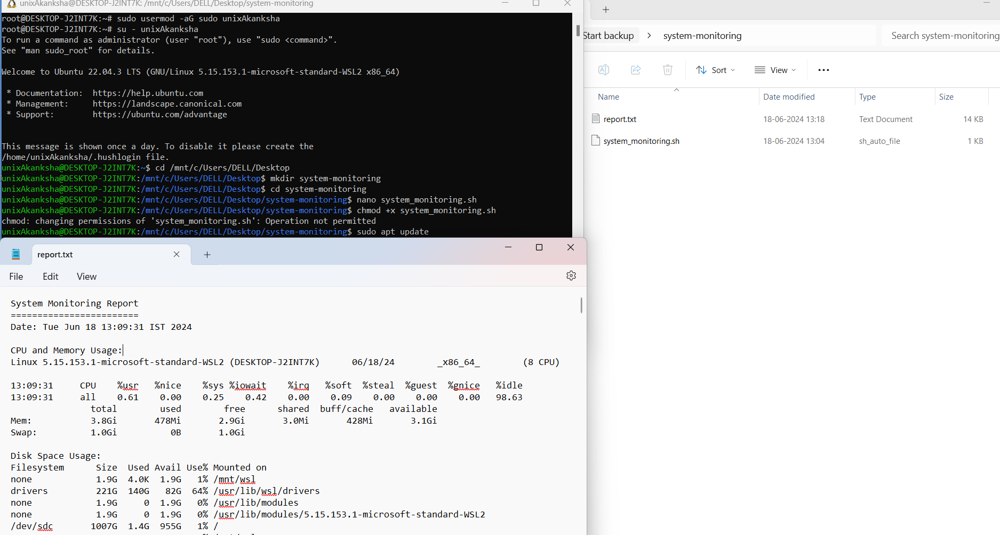

# System Monitoring Tool



## Overview

This project is a system monitoring tool developed in Bash for Linux/Unix systems.</br>
It collects and displays real-time metrics such as CPU usage, memory usage, disk space utilization, and network activity.</br>
The tool provides insights into system performance and resource utilization, essential for monitoring and maintaining system health.

## Features

- **Real-time Monitoring**: Monitor CPU usage, memory usage, disk space, and network activity.
- **Data Logging**: Log system metrics to `report.txt` for analysis and historical tracking.
- **Automated Reports**: Generate daily or weekly reports automatically.
- **User-friendly Interface**: Display system metrics in a readable format in the terminal.

## Installation

1. Clone the repository:

   ```bash
   git clone https://github.com/akankshauniyal/system-monitoring-tool.git
   cd system-monitoring-tool

2. Make the script executable

    ```bash
   chmod +x system_monitoring.sh

3. Run the script to monitor system metrics:

    ```bash
    ./system_monitoring.sh


The script will output real-time metrics to the terminal and update report.txt with detailed system information.
